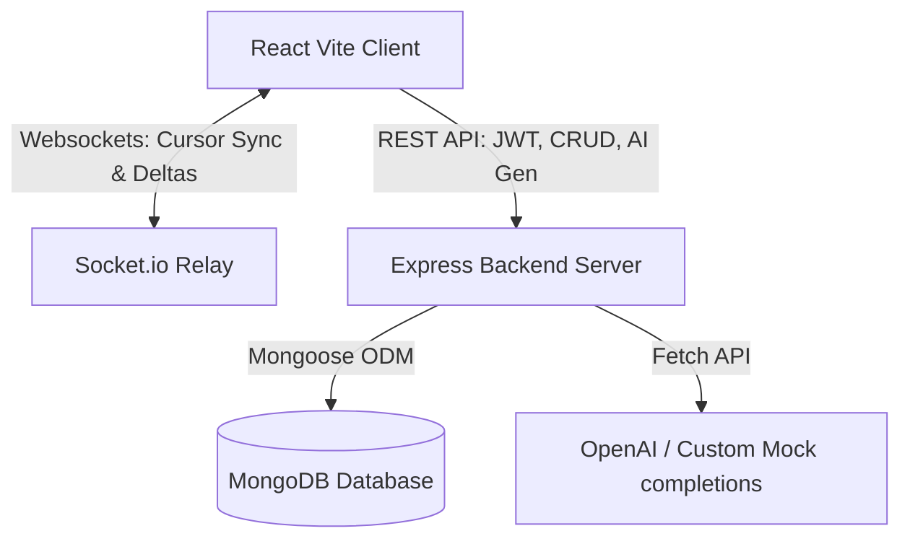

# Collaborative Document Workspace: System Architecture & Scalability Guide

This guide provides a comprehensive overview of the Collaborative Document Editor project, detailing its core features, execution models, known bottlenecks, and the technical architecture required to handle extreme scale operations—specifically when a single document grows to contain **1,000,000 data elements** (e.g., lines, operations, paragraphs, or comments).

---

## 1. Complete Feature Guide

The application is a multi-mode real-time collaborative suite featuring three dedicated document creation engines:

### A. Document Modes
1. **Standard Rich Document**: Rich-text workspace powered by Quill JS. Supports multi-user concurrent editing, formatting ribbons (font, size, style, colors), dynamic headers, inline comments, and suggestions.
2. **ATS Resume Editor**: Structure-controlled workspace containing form components on the left and a live-rendering professional single-page ATS-optimized preview on the right.
3. **Project Proposal Builder**: Structured template form with inline architecture diagram selection and real-time proposal preview panels.

### B. Core SaaS Features
* **User Authentication**: Secure signup and login powered by `bcryptjs` for password hashing and JSON Web Tokens (JWT) for session persistence.
* **Workspace Analytics**: Dashboard showing monthly creation counts, average document counts, and collaborator engagement charts using `Recharts`.
* **Collaborative Presence**: Sockets-based cursor tracking showing the exact caret position and active/idle status (🟢/🟡) of peer collaborators.
* **Version Restorations**: Auto-freezes document snapshots when key changes are saved, allowing users to compare and restore past snapshots.
* **Notifications**: Alert system informing users when they are invited to collaborate.
* **Unified Exports**: Fast client-side PDF exports optimized under 1.5x JPEG compression and Word DOCX structures generated via the `docx` library.

---

## 2. Technical Stack & Execution Architecture



### Data Synchronization Flow:
1. **Deltas**: Text edits inside Standard Mode capture Quill `Delta` operation objects containing insertions, deletions, and attributes.
2. **Broadcasts**: Cursors and edits are emitted immediately to a Socket.io room matching the document ID. Peer clients apply these changes to their editor state in real time.
3. **Autosave**: The client debounce-triggers a REST `PUT` request to update the database state in MongoDB after typing stops.

---

## 3. The 1,000,000 Data Elements Problem

When a document expands to **1,000,000 elements** (e.g., 1 million characters, operations, formatting tags, or paragraphs), standard browser-based collaborative editors will experience severe bottlenecks. Below is an analysis of why the system degrades and how to re-architect it.

### Major Bottlenecks & Failure Modes

| Bottleneck Area | Root Cause | Failure Mode |
| :--- | :--- | :--- |
| **1. Browser DOM Bloat** | Rendering 1,000,000 paragraphs creates millions of DOM nodes. | The browser tab runs out of memory and crashes (Out Of Memory - OOM). Scroll speeds drop to <1 FPS. |
| **2. Database limits** | MongoDB enforces a hard **16MB BSON size limit** per document. | Saving a document with 1,000,000 paragraphs containing formatting delta metadata will fail database insertion. |
| **3. Operational Sync Overhead** | Sending large JSON changes over Socket.io causes high bandwidth consumption. | Websocket buffers overflow, leading to high sync latency and connection termination. |
| **4. Layout & Pagination Engine** | Dynamic page height calculation loops over 1,000,000 elements sequentially. | The browser thread freezes completely (UI stops responding) due to synchronous layout calculation blocking. |
| **5. PDF/DOCX Export Crash** | Converting 10,000 pages to images using `html2canvas` requires massive canvas buffers. | The browser canvas size limit is exceeded (e.g., maximum canvas height is ~32,767px in Chrome), throwing canvas context exceptions. |

---

## 4. Scalability Solutions & Mitigations

To handle 1,000,000 data elements smoothly, the system architecture must be upgraded from a basic document sync to an **enterprise-grade collaborative engine**:

### A. Document Sharding & Database Sectioning
Instead of storing the entire document and all paragraphs in a single MongoDB document, partition the document into a parent-child schema:

```javascript
// Parents collection stores metadata
const DocumentSchema = new mongoose.Schema({
  title: String,
  owner: ObjectId,
  sectionsOrder: [ObjectId] // References to specific chapters/sections
});

// Children collection stores content chunks
const SectionSchema = new mongoose.Schema({
  documentId: ObjectId,
  title: String,
  content: Object, // Stores Quill Delta/Markdown blocks strictly under 100KB
  version: Number
});
```
* **Benefit**: Restricts database queries to specific sections being actively edited. Prevents exceeding the 16MB MongoDB limit.

### B. Virtualized Rendering (Frontend DOM Reduction)
Do not render the entire document at once. Implement a **virtualized list** (using libraries like `react-window` or `react-virtualized`):
* Renders only the active paragraphs visible in the user's viewport, plus a small buffer (e.g., 20 elements).
* As the user scrolls, off-screen nodes are removed and new on-screen nodes are recycled.
* **Benefit**: Keeps the active DOM node count below 200 regardless of whether the document contains 10 elements or 1,000,000 elements.

### C. Differential Sync & Operational Transformation Compaction
* **Operation Throttling**: Batch keystrokes and broadcast aggregated changes every 150ms instead of every single keypress.
* **CRDT/Yjs Integration**: Replace basic Quill syncing with conflict-free replicated data types (CRDTs) like **Yjs** or **Automerge**. These libraries compact operations into highly optimized binary structures and support syncing changes offline.
* **Delta Compaction**: Periodically flatten historical revisions to reduce memory footprints.

### D. Web Worker Pagination Scheduler
Move pagination page calculations out of the main thread:
* Offload the height analysis and array mapping of the 1,000,000 paragraphs to a **Web Worker**.
* The worker estimates sizes using fast character-length heuristics, runs the pagination algorithm asynchronously, and posts the resulting index back to the UI.
* **Benefit**: Keeps the editor interface completely fluid with zero typing lockups.

### E. Server-Side Export Queue (Microservices)
For document compilation (converting large volumes to PDF or DOCX):
1. The client sends an export request to a task queue (e.g., Redis + BullMQ).
2. A server-side microservice (running headless Puppeteer or a native C/Rust PDF generator like WeasyPrint) fetches the database sections, parses the styles, and compiles the PDF/DOCX in the background.
3. The server uploads the finished file to object storage and sends a download link to the user via sockets or email.
* **Benefit**: Avoids memory constraints in client browsers, ensuring reliable exports for large documents.

---

## 5. Architectural Problems & Challenges

1. **Operational Collisions**: Under high latency (e.g., poor mobile connections), two peers writing to the same paragraph simultaneously can cause desynchronization where text insertions duplicate or overlap.
2. **Active Websocket Pools**: If 1,000,000 users collaborate concurrently, managing state loops and tracking cursor coordinates in memory on a single backend instance causes high CPU bottlenecks. Load balancing using Redis Adapter relays across clusters is required.
3. **Offline Caching**: Syncing offline edits when a client reconnects with massive data deltas requires deep three-way merge logic to avoid overwriting newer peer edits.

---

## 6. Strategic Enhancements Roadmap (Next Milestones)

To transition this workspace to an enterprise-grade document compiler, the following developmental enhancements are mapped:

### A. Core Improvements
1. **Dynamic Table of Contents**: Generate a visual index (e.g., *1. Outline / Agenda ...... 1*, *2. Introduction ...... 2*) with dotted alignments and clickable navigation anchors to scroll the preview directly to the section.
2. **Advanced Page Numbering**: Implement separate page numbering rules (Roman numerals `i, ii, iii...` for front matter pages, resetting to Arabic `1, 2, 3...` for main report sections).
3. **Flexible Headers and Footers**: Configure dynamic header labels (e.g., "Project Proposal") and footer text (e.g., "Collaborative Document Workspace | Page 7") across pages.
4. **Interactive Code Blocks**: Renders language code snippets inside report pages with standard syntax highlighting.
5. **Mermaid Diagram Support**: Parse markdown diagram syntax to automatically compile block diagrams and flowcharts in the preview.
6. **Automatic Citation System**: Parse syntax markers (e.g., `[cite:nakka2026]`) and compile formatted APA/IEEE reference indexes.
7. **Mathematical Equation Support**: Integrate KaTeX parsing (e.g., `E = mc^2` or `f(x)=x^2`) to render equations inline inside reports.
8. **University Templates Support**: Provide customized presets (Project Proposal, IEEE Research Paper, College Report, Mini Project Report, Thesis, Internship Report, SRS Document, Meeting Notes, and Resume Builder).
9. **Diverse Export Engines**: Clean formatting preservation when downloading documents as PDF, DOCX, or pure Markdown structures.
10. **Context-Aware AI Writing Assistant**: Specialized endpoints to generate core report sections (Abstract, Objectives, Problem Statement, Literature Survey, Conclusion).

---

## 7. Highlight Feature: Split-Screen A4 Preview with Page-Aware Rendering

The most distinctive feature of the Project Proposal Builder is its **Split-Screen A4 preview with page-aware rendering**.

Unlike standard collaborative markdown editors that simply output:
$$\text{Editor} \longrightarrow \text{PDF}$$

Our workspace executes a full layout compiling chain:
$$\text{Form Editor} \longrightarrow \text{Layout Engine} \longrightarrow \text{Page Break Engine} \longrightarrow \text{A4 Pages} \longrightarrow \text{PDF}$$

By measuring element heights dynamically inside A4 boundaries, the system behaves more like professional editors (**Microsoft Word, Google Docs, Overleaf**) rather than a simple database CRUD viewer. This page-aware rendering provides absolute layout fidelity for proposal submissions and formal publications.

---

## 8. Applied Spacing Fixes & Next-Gen Pagination Roadmap

### A. Completed Spacing Enhancements
We resolved vertical layout crowding in the Project Proposal view and PDF export:
* **Section Separation**: Introduced a clean `32px` vertical margin-top gap between consecutive sections to separate titles from previous lists.
* **Typography Hierarchy**: Implemented a professional spacing scale:
  $$\text{Section Heading} \xrightarrow{\quad 12\text{px} \quad} \text{Section Content} \xrightarrow{\quad 32\text{px} \quad} \text{Next Section Heading}$$
* **Layout Stability**: Applied standardized padding and margins on elements to prevent collapses during canvas rendering and PDF compiles.

### B. Advanced Typesetting Roadmap
To reach absolute typesetting parity with standard word processors, the layout engine's roadmap incorporates the following advanced controllers:

1. **Heading Orphan Prevention**: Automatically detects if the remaining vertical space on a page is too small to render a section heading along with at least its first paragraph. If the height is insufficient, the system forces a page break to move the entire section to the next page.
2. **List Block Integrity**: Avoids breaking lists across pages awkwardly. Grouped list elements are treated as single block chunks, moving together or maintaining a minimum count on page shifts.
3. **Widow and Orphan Protection**: Prevents leaving a single trailing line of a paragraph at the top of a page (widow) or a single starting line at the bottom of a page (orphan).
4. **Page-Aware Image Scaling**: Images automatically scale down to fit the remaining vertical viewport height. If the space is less than a minimum height, the image along with its caption is moved to the next page as a single cohesive unit.
5. **Auto-Numbered Captions**: Figure and table counters auto-increment based on the chapter index (e.g., *Figure 3.2: Collaborative System Architecture*, *Table 1.1: User Roles*).
6. **Code Block Typesetting**: Dedicated syntax block containers that support line numbers, dark/light themes, and managed page breaks.
7. **Long-Term Compiler Pipeline**:
```
  [Form Components / Markdown Input]
                  │
                  ▼
          [Structured Data]
                  │
                  ▼
          [Layout Compiler]
                  │
                  ▼
         [Typography Engine]
                  │
                  ▼
           [Spacing Engine]
                  │
                  ▼
          [Pagination Engine]
                  │
                  ▼
       [Widow/Orphan Controller]
                  │
                  ▼
       [Header/Footer Injector]
                  │
                  ▼
           [A4 Canvas View]
                  │
                  ▼
           [PDF/DOCX Export]
```


