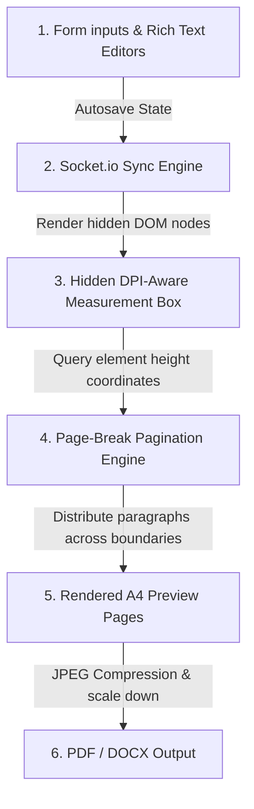

# Project Proposal Workspace - Architecture & Feature Guide

Welcome to the documentation guide for the **Project Proposal Workspace** (College Report Maker). This document outlines how the custom proposal template editor functions under the hood, its list of rich features, and its premium design/UI aesthetics.

---

## 1. How the Application Works (Architecture)

The Project Proposal editor bypasses the generic Quill text editor to provide a structured, form-based document compilation workspace.

### Core Architecture Flow:
1. **Routing and Page Load**:
   - When a user opens a document with type `PROPOSAL` at `/document/:id`, [DocumentPage.jsx](file:///Users/srijithsharma/Desktop/projects/Collaborative%20Document%20Editor/client/src/pages/DocumentPage.jsx) queries the Mongoose database.
   - Instead of mounting `DocumentEditor` (Quill), it dynamically imports and mounts [ProposalEditor.jsx](file:///Users/srijithsharma/Desktop/projects/Collaborative%20Document%20Editor/client/src/components/ProposalEditor.jsx), passing the document ID, user role, and initial database data.
2. **Database Representation**:
   - The document model contains a flexible `proposalData` sub-document in MongoDB. This schema hosts sections, team details, metadata status, and links to external resources.
3. **Real-time Operations Sync**:
   - Collaborators typing in any text area trigger lightweight state broadcasts through Socket.io (`send-proposal-changes`).
   - Other users currently viewing the document receive these changes (`receive-proposal-changes`) and merge them locally.
   - Inputs are automatically debounced and saved to the database after a 2-second idle window.
4. **Version History Support**:
   - Snapshot triggers capture the entire state object, allowing editors to revert to older versions using the Version History panel.

---

## 2. Key Features

The proposal editor comes pre-equipped with everything a university project team or business writer needs to draft proposals:

* **Structured Academic Sections**: Includes preset headings such as *Introduction, Objectives, Existing vs. Proposed System, Research Gaps, problem Statement, System Architecture, Outcomes, Methodology, Results, and References*.
* **Live Statistics Checklist**:
  - Automatically calculates total **Word Count** across all headings.
  - Displays a progress bar showing **Sections Completed**.
  - Tracks document **Status** (`Draft`, `In Review`, `Approved`, `Submitted`) and **Version** metadata.
* **Proposal Navigator**: A list of active sections that highlights the current reading position. Shows a green checkmark `✓` for completed sections.
* **AI Writing Assistant**: An automatic generation tool that inputs tailored boilerplate outlines, technical listings, and academic goals for specific sections.
* **Custom Sections Manager**: Users can dynamically click **Add Section** to append custom paragraphs or delete obsolete headings.
* **External Attachments**: Direct linking fields to keep resources like budget spreadsheets, references, or flowcharts attached.
* **Diagram embeds**: Support for adding custom image URLs or selecting preset architecture diagram mockups.
* **Layout-Aware PDF Export**: Generates and compiles pixel-perfect, print-friendly A4 page PDF layouts containing all texts, tables, formatting, and images using `html2canvas` and `jspdf`.

---

## 3. UI Design and Layout Aesthetics

The Project Proposal editor features a clean split-panel interface following premium MERN dark-glass aesthetic guidelines:

### Layout Breakdown:
* **Desktop Split View**:
  - **Left Column (Form-Based Editor)**: Utilizes transparent, glassmorphic Material UI Accordion panels with subtle borders (`rgba(255,255,255,0.06)`), glowing purple active borders, and backdrop blurs. Users fill out headings through isolated input fields to maintain focus.
  - **Right Column (Live Preview Paper)**: Renders a realistic white A4 paper sheet suspended on a grey background. Content dynamically renders with formal formatting (bold headings, bullet lists, custom diagrams) to show exactly how the printed output will look.
* **Active Section Tracking**: Uses an `IntersectionObserver` to detect what page area the user is viewing in the right preview sheet, automatically highlighting the corresponding item in the left navigation tree.
* **Mobile-Responsive Swapper**: On tablet and mobile viewports, the split view collapses into dynamic swapper tabs: **Edit Form** and **Live Preview**, ensuring accessibility on the go.

---

## 4. Strategic Enhancements Roadmap (Next Milestones)

To evolve the structured editor into an advanced document compile suite, we have mapped out the following technical milestones:

### 1. Interactive Table of Contents Anchors
- **Goal**: Automatically build a dynamic index page (e.g., *1. Outline / Agenda ...... 1*, *2. Introduction ...... 2*) matching calculated page starts.
- **Interactions**: Clicking any row smoothly scrolls the right preview container to focus on the corresponding page boundary.

### 2. Page-Aware Roman / Arabic Header-Footers
- **Goal**: Implement page-layout rules based on document section classes:
  - **Front Matter Pages** (Cover page, Certificate, Declarations, Abstract): Render Roman numerals (`i, ii, iii...`) inside the page footer.
  - **Main Report Pages** (Chapters, Sections): Reset pagination and render Arabic numerals (`1, 2, 3...`) in the footer.
  - **Header Labels**: Dynamic section headers matching chapter titles.

### 3. KaTeX Mathematical Expression Engines
- **Goal**: Support standard LaTeX mathematical notations (e.g., `$E = mc^2$` or inline `$\frac{a}{b}$`) inside the text editor fields.
- **Render**: Compile mathematical expressions using KaTeX to display clean scientific notation within report previews.

### 4. Interactive Code Block Highlighters
- **Goal**: Recognize programming languages inside rich text fields.
- **Render**: Render syntax-highlighted code blocks (using Prism.js or highlight.js) inside preview pages.

### 5. Mermaid Canvas Node Rendering
- **Goal**: Embed flowcharts, state diagrams, and sequences using standard Markdown Mermaid syntax (e.g., `mermaid graph TD`).
- **Render**: Parse code blocks and generate vector diagram canvases automatically in the live preview.

### 6. Document Template Registries
- **Goal**: Register diverse template layouts in the dashboard gallery.
- **List of Presets**:
  - **Project Proposal**: Standard college template.
  - **IEEE Research Paper**: Double-column research layout.
  - **Thesis**: Long-form structured document.
  - **Internship Report**: Weekly-log format.
  - **SRS Document**: Software Requirements Specification structure.
  - **Mini Project Report / College Report**: Standard department outline.
  - **Meeting Notes**: Agenda logs.
  - **Resume Builder**: ATS single-page formats.

---

## 5. Highlight Feature: Split-Screen A4 Preview with Page-Aware Rendering

The most innovative feature of the proposal builder is its **Split-Screen A4 preview with page-aware rendering**.

Most online collaborative editors simply render editing forms directly as markdown scrolling viewports or compile a downloadable document:
$$\text{Form Inputs} \longrightarrow \text{Static HTML Page} \longrightarrow \text{Export to PDF}$$

Our system bridges this gap by implementing an active layout-compiling pipeline that operates more like a desktop word processor (**Microsoft Word, Google Docs, Overleaf**):

### Key Compilation Steps:
1. **DPI-Aware Measurement**: A hidden container renders the raw section texts, headers, code snippets, and figure attachments using the exact font configurations (Times New Roman, 12pt, 1.5 line height) at the precise printable width (`602px` at 96 DPI).
2. **Page-Break Pagination Engine**: The system dynamically scans the rendered heights of individual paragraph nodes and divides them sequentially. If an element pushes the current page height beyond the vertical print boundary (`810px`), it instantly splits the content, pushing remaining paragraphs onto a new page canvas.
3. **Reset Rules**: Heading boundaries (e.g., Chapter markers) force automatic page breaks.
4. **Visual Page-Margins Representation**: Creates A4 page cards (`210mm x 297mm`) in the browser viewport. The user edits document contents on the left, and immediately sees accurate page flows, headers, and footers on the right, avoiding any layout surprises upon export.

